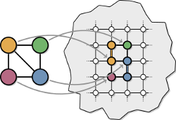

# Virtual Hardware Embedding Suite for Adiabatic Quantum Computing

## 1. Introduction

Adiabatic quantum computing has evolved in recent years from a theoretical
field into an immensely practical area, a change partially sparked by D-Wave
System's quantum annealing hardware. These multimillion-dollar quantum
annealers offer the potential to solve optimization problems millions of times
faster than classical heuristics, prompting researchers at Google, NASA and
Lockheed Martin to study how these computers can be applied to complex
real-world problems such as NASA rover missions. Unfortunately, compiling
(embedding) an optimization problem into the annealing hardware is itself a
difficult optimization problem and a major bottleneck currently preventing
widespread adoption. Additionally, while finding a single embedding is
difficult, no generalized method is known for tuning embeddings to use minimal
hardware resources. To address these barriers, we introduce a graph-theoretic
framework for developing structured embedding algorithms. Using this framework,
we introduce a biclique virtual hardware layer to provide a simplified
interface to the physical hardware. Additionally, we exploit bipartite
structure in quantum programs using odd cycle transversal (OCT) decompositions.
By coupling an OCT-based embedding algorithm with new, generalized reduction
methods, we develop a new baseline for embedding a wide range of optimization
problems into fault-free D-Wave annealing hardware. To encourage the reuse and
extension of these techniques, we provide an implementation of the framework
and embedding algorithms.


## 2. How to cite

Coming soon with arxiv link!

## 3. How to run

First, run ``make`` from the project's root folder to create subfolders and compile the C++ code. A successful output will look like this:

```
Compiling C++ code
g++ -std=c++11 -O2 embedding/*/src/*.cpp embedding/driver.cpp -o embedding/driver.exe
Build completed!
```

Next, make sure the Python dependencies are installed:

```
python --version
pip install -r requirements.txt
```
Specifically, this code is tested on Python 2, and uses NetworkX and Seaborn for graph theory and plotting, respectively.

The following subsection detail three standard use cases.


### 3a. Paper experiment recreation

To recreate the experiments presented in the paper, run

```
python recreate_paper.py [num_threads] [experiment]
```

Where `num_threads` is the number of CPU threads you want to use, and experiment is one of [`small`, `medium`, `large`, `cmr`, `hybrid`]. Specifically, Figure 7 from the paper is `hybrid`, Figure 8 is `cmr`, and Figure 9 is `medium`; `small` uses a Chimera(4,4,4) hardware and `large` a Chimera(4,16,16) hardware.


To view these plots, look in folder ``data/plots/[experiment name]/``.

### 3b. New batch experiments

One extension of this code is to run experiments on a wider range of experiment parameters, with new input graph generators and/or with new embedding algorithms.

Covering a different parameter space requires no code modification, simply an appropriate .config file in the ``data/config/`` folder in the following format:

```
#hardware  
[L], [M], [N]
#programs  
[graph generator] [i]:[j]:[step] [density]
#program_seeds
[i]:[j]
#algorithms
[algorithm name]
#algorithm_seeds
[i]:[j]
```

The hardware category accepts one or more lines, where each line specifies a Chimera(L, M, N) graph without hard faults. The program category accepts one or more lines, where each line specifies a graph generator, a range over the number of vertices (from i to j with a specified step size), and an edge density. The provided graph generators include ``gnp``, ``reg``, ``powerlaw``, and ``nb``. The supported densities include ``low``, ``medium``, ``high``; these values are defined per graph generator in the paper. The program seeds category defines a range of seeds used from i to j (inclusive). The algorithm names category accepts one or more lines, where each line specifies an embedding algorithm name. The provided embedding algorithms include ``triad``, ``triad-reduce``, ``cmr``, ``oct``, ``oct-reduce``, ``fast-oct``, and ``fast-oct-reduce``. The algorithm seeds category defines a range of seeds from i to j (inclusive) to be used on any stochastic algorithm.

To add new input graph generators, ``scripts/program_generator.py`` needs to be modified with a method to generate the graph, a write method, and an associated name to be used in the config files. For example, to generate noisy bipartite graphs we use generator method ``random_noisy_bipartite_graph``, write method ``write_noisy_bipartite``, and use ``nb`` as shorthand in the config files. An alternative to adding a new graph generator method is to use an existing one from [NetworkX](https://networkx.github.io/). In this case, it suffices to add a write method and associated name; see ``write_gnp`` and ``gnp`` as an example.

### 3c. Computing individual embeddings

Another use of this code is to compute embeddings directly using the C++ code. In this case, you want to call ``./embedding/driver``. Use the ``--help`` argument for proper usage information.

(Please contact the author if you are particularly interested in this option -- he is currently creating a more accessible Python wrapper for this functionality.)

### 4. Code organization
* The ``data/`` folder contains both input and output data used in batch experiments, split into the following subfolders:
   * ``data/config/`` contains .experiment files used for defining a batch experiment.
   * ``data/input/`` contains the input (problem) graphs generated by ``scripts/experiment.py`` according to the .experiment file being run.
   * ``data/output/`` contains the output data such as the Chimera embedding, run times, and latex visualizations.
   * ``data/plots/`` contains plots generated from an .experiment file using the output data.
* The ``embedding/`` folder contains the C++ code used for the embedding algorithms.
   * ``driver.cpp`` is the primary driver that should be called for computing an embedding algorithm.
   * The ``embedding/algorithm/`` subfolder contains the various embedding algorithms used.
   * The ``embedding/utilities/`` subfolder contains some general tools (e.g. graph data structure) used by the embedding algorithms; these may be useful in future extensions.
* The ``scripts/`` folder contains the Python code used for batch experiments.
   * ``scripts/experiment.py`` is used to run a batch experiment.
   * ``scripts/plot.py`` is used to plot the output of a batch experiment.
   * ``scripts/program_generator.py`` is used by ``experiment.py`` to generate input graphs.
   * ``scripts/utilities.py`` is used to store common routines used by the other scripts.

### 5. Extensions and Future Work

This suite is provided as a proof-of-concept for the algorithms described, and should not be viewed as tuned, production-ready code. Depending on your intended uses, we recommend considering the following extensions:

1. Faster exact algorithms for computing MinOCT. The tuned code from [Huffner 2009](http://jgaa.info/accepted/2009/Hueffner2009.13.2.pdf) should provide much faster exact solutions. [Akiba & Iwata 2014](https://arxiv.org/pdf/1411.2680.pdf) experimentally show that converting MinOCT to Minimum Vertex Cover (MinVC) is a practically-motivated alternative. Such a MinVC instance could then be solved with either their algorithms or the other software mentioned (CPLEX and MCS).

2. An ensemble of MinOCT approximations. We run our greedy MinOCT algorithm 10,000 times and take the best approximation found. We recommend extending this simple algorithm to an ensemble of approximation algorithms/heuristics. For example, using different (or stochastic) greedy choices is an easy extension, and [Luby's Algorithm](https://en.wikipedia.org/wiki/Maximal_independent_set#Random-selection_parallel_algorithm_.5BLuby.27s_Algorithm.5D) is one way to parallelize these computations.

3. Algorithmic tuning in the reduction subroutines. Currently we define a scoring problem on the virtual hardware and use 2Ex-Reduce to local search a reasonably-sized neighborhood. Future work could include trying different values of k to find a threshold where increasing the neighborhood size is no longer useful. Additionally, a stochastic version (instead of gradient descent) might lead to better results.

4. Parallelization. Assuming that MinOCT is not the bottleneck, the remaining code should benefit more from GPU parallelization (e.g. OpenACC) than CPU parallelization (e.g. OpenMP). For example, evaluating scores in kEx-Reduce could be a GPU kernel, as could the search itself. If MinOCT is the bottleneck, the iterative-compression--based algorithms lend themselves to CPU parallelization at the loop where the current solution is split into three parts, and CPU+GPU parallelization when the max flow computations are evaluated. If this parallelization is desirable, we recommend using Huffner's heuristic improvements to first prune the search space ([Huffner 2009](http://jgaa.info/accepted/2009/Hueffner2009.13.2.pdf)).
